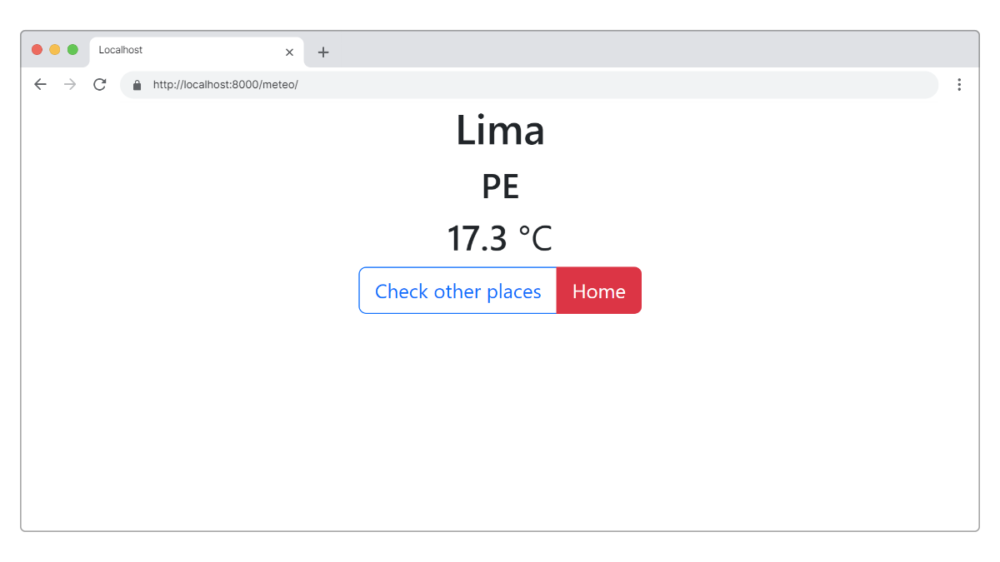
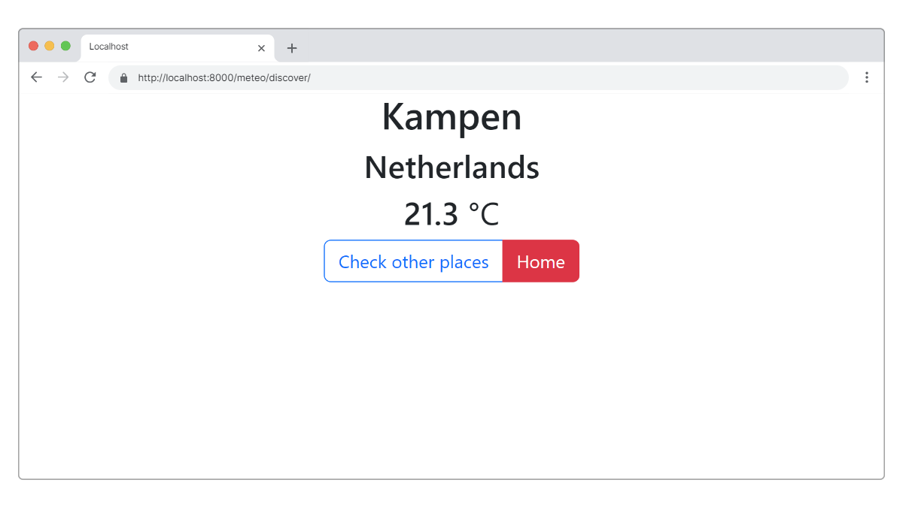

# WeatherApp

WeatherApp es una aplicación web desarrollada en Django que permite a los usuarios obtener la temperatura actual de su ubicación o descubrir la temperatura en diferentes ciudades alrededor del mundo.

## Características

- Obtener la temperatura actual basada en la ubicación del usuario.
- Descubrir la temperatura en diferentes ciudades seleccionadas al azar.

## Tecnologías Utilizadas

- Python 3
- Django
- Bootstrap para el diseño frontend
- API de Open-Meteo para obtener datos de temperatura

## Requisitos

Para ejecutar este proyecto, necesitarás:

- Python 3.6 o superior
- Django
- Acceso a Internet para realizar llamadas a la API de Open-Meteo

## Instalación

Sigue estos pasos para instalar y ejecutar el proyecto en tu sistema local:

1. Clona el repositorio:
   ```
   git clone https://github.com/tu-usuario/WeatherApp.git
   ```
2. Navega al directorio del proyecto:
   ```
   cd WeatherApp
   ```
3. Crea y activa un entorno virtual (opcional pero recomendado):
   ```
   python3 -m venv venv
   source venv/bin/activate  # En Windows: venv\Scripts\activate
   ```
4. Instala las dependencias:
   ```
   pip install -r requirements.txt
   ```
5. Realiza las migraciones necesarias:
   ```
   python manage.py migrate
   ```
6. Ejecuta el servidor de desarrollo:
   ```
   python manage.py runserver
   ```

Ahora, la aplicación debería estar corriendo en `http://127.0.0.1:8000/`.

## Uso

- Para ver la temperatura en tu ubicación actual, navega a `http://127.0.0.1:8000/meteo/`.
- Para descubrir la temperatura en diferentes ciudades, navega a `http://127.0.0.1:8000/meteo/discover/`.

## Capturas de Pantalla

A continuación, algunas capturas de pantalla de la aplicación:



## Agradecimientos

Este proyecto fue desarrollado siguiendo el tutorial [Building APIs With Django REST Framework](https://blog.jetbrains.com/pycharm/2023/09/building-apis-with-django-rest-framework/) por Denis Mashutin. Agradezco a Denis Mashutin por su excelente guía.
